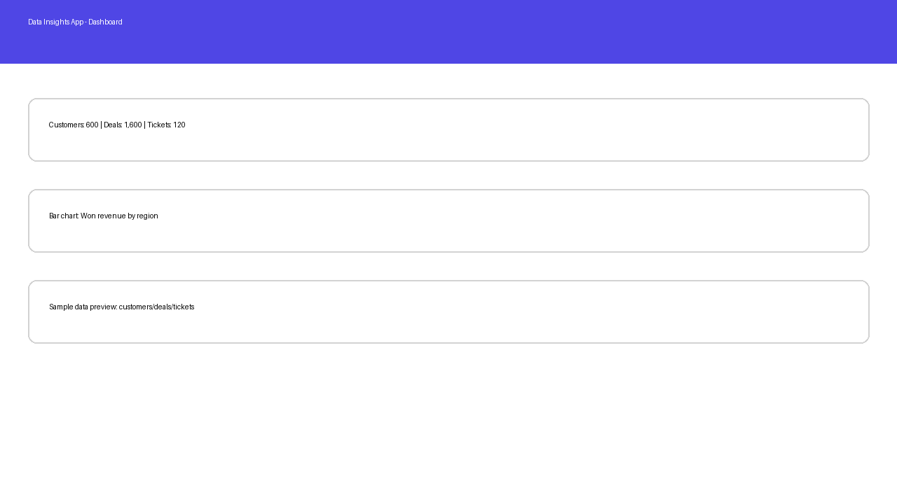
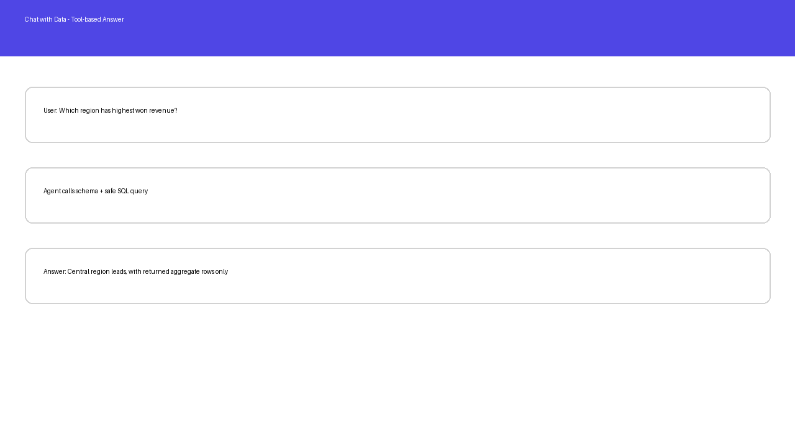
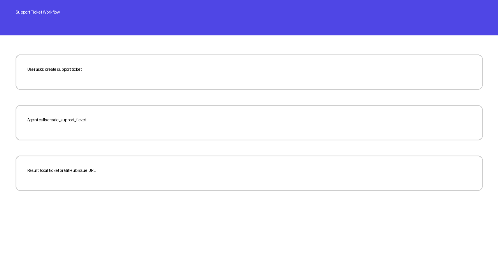

# Data Insights App — Chat with Data

A Streamlit + Python GenAI application that lets users ask business questions about a database without sending the full datasource to the LLM. The agent uses function calling tools to inspect schema, run safe read-only SQL queries, and create support tickets.

## Requirements coverage

| Requirement | Implementation |
|---|---|
| Data has at least 500 rows/entities | SQLite sample DB contains 600 customers, 1,600 deals, and 120 support tickets. |
| Python agent | `app/agent.py` |
| Streamlit UI | `streamlit_app.py` |
| Datasource not fully sent to LLM | Only schema, aggregate results, and limited query output are passed through tools. |
| Business UI information outside chat | KPI cards, revenue chart, sample table preview, sample queries. |
| Console logs | Python `logging` is configured in `streamlit_app.py`; tool calls are logged. |
| Support ticket workflow | Manual form + agent tool `create_support_ticket`. GitHub issue if configured, local ticket fallback. |
| Function calling | Three tools: `get_database_schema`, `run_safe_sql_query`, `create_support_ticket`. |
| At least 2 different tools | Uses schema, SQL, and ticket tools. |
| Safety feature | SQL guard blocks DELETE, DROP, UPDATE, INSERT, ALTER, TRUNCATE and only allows SELECT. |
| README with workflow screenshots | See screenshots below. |
| Git upload | Push this root folder to the `main` or `master` branch. |

## Project structure

```text
.
├── app/
│   ├── agent.py
│   ├── db.py
│   └── tickets.py
├── data/
│   ├── generate_data.py
│   └── sales_support.db
├── screenshots/
│   ├── 01_dashboard.png
│   ├── 02_chat.png
│   └── 03_ticket.png
├── .streamlit/
│   └── config.toml
├── requirements.txt
├── streamlit_app.py
└── README.md
```

## Setup

```bash
python -m venv .venv
source .venv/bin/activate        # macOS/Linux
# .venv\Scripts\activate         # Windows PowerShell
pip install -r requirements.txt
```

Create a local `.env` file:

```env
OPENAI_API_KEY=your_openai_api_key
# Optional GitHub issue creation:
GITHUB_TOKEN=your_github_personal_access_token
GITHUB_REPO=owner/repository
```

Do not commit `.env` or `.streamlit/secrets.toml`.

## Run locally

```bash
python data/generate_data.py
streamlit run streamlit_app.py
```

Open the local URL shown in the terminal.

## Example workflow

### 1. Dashboard view

The user sees business KPIs, a revenue chart, sample rows, and sample questions before using chat.



### 2. Chat with data

Example prompt:

```text
Which region has the highest won revenue?
```

Expected workflow:

1. Agent calls `get_database_schema`.
2. Agent calls `run_safe_sql_query` with a SELECT-only aggregate query.
3. Agent summarizes the result without receiving the full database.



### 3. Support ticket

The user can ask:

```text
Create a support ticket because I cannot access customer revenue details.
```

The agent calls `create_support_ticket`. If GitHub credentials are configured, it creates a GitHub issue. Otherwise, it creates a local database ticket.



## Safety behavior

Dangerous requests are blocked. Example:

```text
Delete all lost deals.
```

The assistant should refuse because the system prompt and SQL validator allow only read-only SELECT queries.

## Git upload instructions

```bash
git init
git branch -M main
git add .
git commit -m "Initial data insights app"
git remote add origin https://github.com/YOUR_USERNAME/YOUR_REPO.git
git push -u origin main
```

## Optional deployment

## Deployment

This application is deployed on Hugging Face Docker Spaces.

Live demo:

https://huggingface.co/spaces/Katherina14/GenAI_Capstone1
